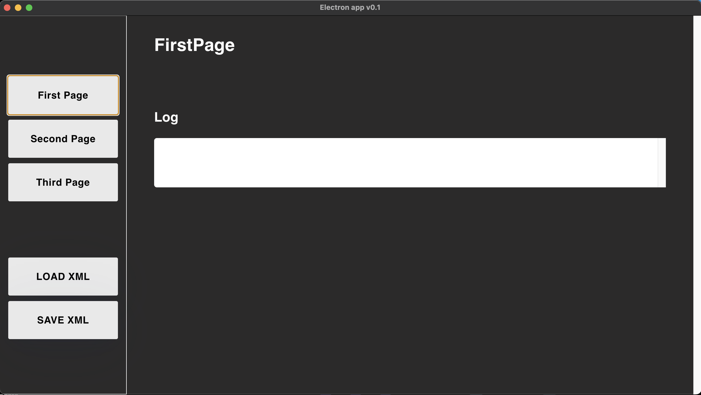

# Electron boilerplate

## Development

### Requirements

- Node ^16

### Start development process

```sh
npm i 
npm run start
```

## Logging

- On Backend side use winston for logging.
- On frontend side use Redux middleware with specific format of messages for save logs into the store.

### Build desktop version of the app

```sh
npm run package
```

### Builded app destination:
 - On Mac: `release/build/mac[-arm64]`

## Appearance

